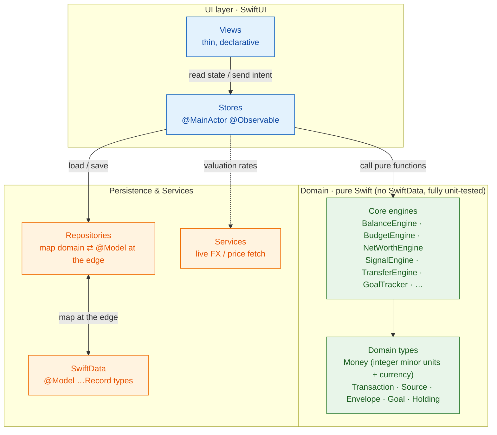

# Money Lover

A personal, **100% on-device** iPhone finance app. Native SwiftUI, Swift 6, SwiftData — no backend, no accounts, no network sync. All data lives locally on the device.

Track balances across accounts/cards/holdings, budget with envelopes, set savings goals, reconcile drift, and get deterministic rule-based spending advice.

> Personal project (not for sale). Target: **iOS 26 / Swift 6.2 / SwiftUI only**, no third-party frameworks.

---

## Requirements

| Tool | Version | Notes |
|------|---------|-------|
| macOS | Sonoma+ (Apple Silicon) | |
| Xcode | **26.5+** | Includes Swift 6.3 toolchain |
| iOS Simulator runtime | **iOS 26.5** | Install via Xcode → Settings → Components, or `xcodebuild -downloadPlatform iOS` |
| [XcodeGen](https://github.com/yonaskolb/XcodeGen) | 2.45+ | `brew install xcodegen` |

The Xcode **project file is generated** from `project.yml` by XcodeGen — it is not hand-edited. Any time you add, remove, or rename source files, regenerate it.

---

## Setup

```bash
# 1. Install the project generator (one time)
brew install xcodegen

# 2. From the project root, generate MoneyLover.xcodeproj
cd money-lover
xcodegen generate

# 3a. Open in Xcode and run (⌘R), or…
open MoneyLover.xcodeproj
```

There is nothing else to fetch — no SPM/CocoaPods/Carthage dependencies.

---

## Run on the Simulator (command line)

The project is wired for the **iPhone 17** simulator. Substitute any installed device name.

```bash
cd money-lover

# Boot the simulator and open the Simulator app
open -a Simulator
xcrun simctl boot "iPhone 17" 2>/dev/null

# Build, install, and launch
xcodebuild -project MoneyLover.xcodeproj -scheme MoneyLover \
  -destination 'platform=iOS Simulator,name=iPhone 17' \
  -derivedDataPath .build build

xcrun simctl install booted .build/Build/Products/Debug-iphonesimulator/MoneyLover.app
xcrun simctl launch --terminate-running-process booted com.hnkhoi.moneylover
```

Grab a screenshot of whatever's on screen:

```bash
xcrun simctl io booted screenshot /tmp/moneylover.png
```

List the simulators you have available:

```bash
xcrun simctl list devices available | grep -i iphone
```

### Seed sample data (DEBUG builds)

Launch with the seed flag to populate realistic demo data (accounts, cards, holdings, envelopes, goals, transactions):

```bash
xcrun simctl launch --terminate-running-process booted \
  com.hnkhoi.moneylover SIMCTL_CHILD_SEED_SAMPLE_DATA=1
```

You can also seed/clear from inside the app: **Config → Debug → Seed sample data / Clear all data** (DEBUG builds only). First launch with no data shows an onboarding sheet to set opening balances.

---

## Run the tests

[Swift Testing](https://developer.apple.com/documentation/testing) suite (TDD throughout — the pure `Core` engines are fully unit-tested).

```bash
cd money-lover
xcodebuild test -project MoneyLover.xcodeproj -scheme MoneyLover \
  -destination 'platform=iOS Simulator,name=iPhone 17' -derivedDataPath .build
```

Run a single suite while iterating:

```bash
xcodebuild test -project MoneyLover.xcodeproj -scheme MoneyLover \
  -destination 'platform=iOS Simulator,name=iPhone 17' -derivedDataPath .build \
  -only-testing:MoneyLoverTests/SignalEngineTests
```

In Xcode: **⌘U**.

### Test tiers (Smoke / Full)

The UI suite is split into two test plans (ADR-0011). PRs run **Smoke** (the curated ≤5 min gate); the **Full** suite runs nightly. Pick a plan with `-testPlan`:

```bash
# Smoke — the PR gate (~2.5 min UI exec): unit suite + curated UI subset
xcodebuild test -project MoneyLover.xcodeproj -scheme MoneyLover \
  -destination 'platform=iOS Simulator,name=iPhone 17' -testPlan Smoke

# Full — everything (the nightly regression)
xcodebuild test -project MoneyLover.xcodeproj -scheme MoneyLover \
  -destination 'platform=iOS Simulator,name=iPhone 17' -testPlan Full
```

In Xcode, switch plans from the scheme's test-plan selector. Which test belongs in which tier — and the merge gate that requires `build`/`unit-tests`/`ui-smoke` — is documented in [`docs/guidelines/testing.md`](docs/guidelines/testing.md) § Test tiers.

---

## Project structure

```
money-lover/
├── project.yml              # XcodeGen spec — source of truth for the Xcode project
├── MoneyLover/
│   ├── App/                 # @main entry, RootView (tabs), AppSchema (SwiftData models)
│   ├── Core/                # Pure domain types + engines (no SwiftData, fully tested)
│   ├── Persistence/         # @Model …Record types + Repositories (mapped at the edge)
│   ├── Services/            # Side-effecting helpers (e.g. live price/rate fetch)
│   ├── DesignSystem/        # Theme tokens, shared views
│   ├── Features/            # One folder per feature (Store + screens)
│   ├── Debug/               # SampleData (DEBUG only)
│   └── Resources/           # Assets
├── MoneyLoverTests/         # Swift Testing suites
├── docs/                    # ADRs + engineering/testing/agent guidelines
├── CONTEXT.md               # Domain glossary
└── prototype/               # Throwaway HTML visual reference (not built)
```

**Architecture** (see `docs/adr/0006-mv-architecture-pure-domain.md`): thin SwiftUI Views → `@MainActor @Observable` Stores → pure `Core` engines → `Persistence` repositories. Money is always integer minor units + currency — never `Double`.



**Why this shape:** the Core engines are pure functions over plain Swift types — no SwiftData, no UI, no I/O. That's what makes them fast to test (262 unit tests run in milliseconds, no simulator needed) and lets the persistence layer stay swappable behind repositories.

For the full picture before contributing, read `CLAUDE.md`, then `docs/guidelines/{engineering,testing}.md` and `docs/adr/`.

---

## Design decisions

Every significant choice is captured as an [Architecture Decision Record](docs/adr/). The most consequential ones:

| ADR | Decision | Why it matters |
|-----|----------|----------------|
| [0001](docs/adr/0001-on-device-only-no-backend.md) | **On-device only, no backend** | No accounts, no servers, no network sync — privacy by construction, zero attack surface. |
| [0002](docs/adr/0002-native-swiftui-stack.md) | **Native SwiftUI / Swift 6 stack** | Zero third-party dependencies; nothing to audit, update, or break. |
| [0006](docs/adr/0006-mv-architecture-pure-domain.md) | **MV + pure domain** | Business logic lives in pure engines, testable without UI or a database. |
| [0004](docs/adr/0004-rule-based-recommendations.md) | **Rule-based advice; AI only phrases it** | Spending analysis is deterministic Swift "Signals"; the on-device model never does the math. |
| [0007](docs/adr/0007-goals-are-funded-assets.md) | **Goals are funded assets** | A contribution is a *Transfer*, so net worth stays invariant — one asset becomes another. |
| [0010](docs/adr/0010-holding-trades-derive-quantity.md) | **Holdings derive quantity from trades** | Live quantity = opening + ΣBuys − ΣSells — the balance invariant applied to quantity. |
| [0012](docs/adr/0012-backfill-is-a-normal-transaction.md) | **Backfill restates opening balance** | A forgotten past transaction keeps current balance correct without rewriting history. |
| [0011](docs/adr/0011-tiered-ui-tests.md) | **Tiered tests (Smoke / Full)** | A ≤5-min gate on every PR; full regression nightly — fast feedback without losing coverage. |

A one-page narrative overview — pitch, architecture, and the reasoning behind these decisions — lives in [`docs/project-overview.md`](docs/project-overview.md).

---

## Troubleshooting

- **"No such module" / red errors in Xcode after adding files** — you added a source file without regenerating. Run `xcodegen generate`.
- **Build fails: iOS 26.5 runtime missing** — `xcodebuild -downloadPlatform iOS`, or install via Xcode → Settings → Components.
- **`xcrun simctl: device not booted`** — `xcrun simctl boot "iPhone 17"` first (or pick a name from `simctl list devices available`).
- **Signing errors when building to a physical device** — set your team in Xcode (Signing & Capabilities); `DEVELOPMENT_TEAM` is intentionally blank in `project.yml` for simulator-only builds.

---

## Status

14 of 16 planned features implemented and tested (simulator-verified). The two remaining features — **Voice entry** (on-device speech + Foundation Models) and the **Accessibility/rotation pass** — require a physical device and are tracked in `.scratch/money-lover/issues/`.

---

## License

This project is licensed under the **BSD 3-Clause License** — see the [LICENSE](LICENSE) file for details.
