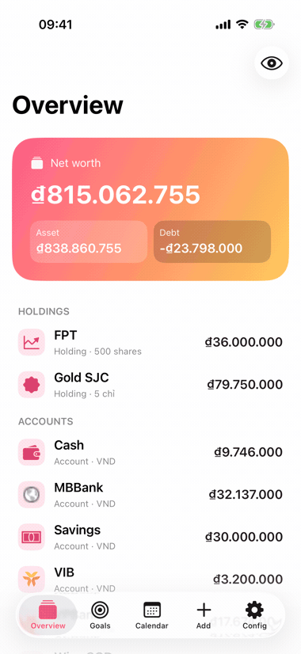
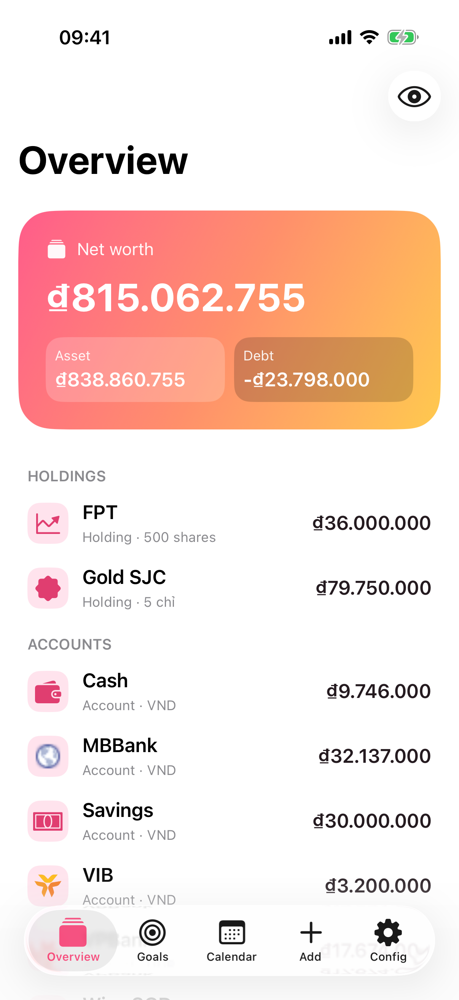
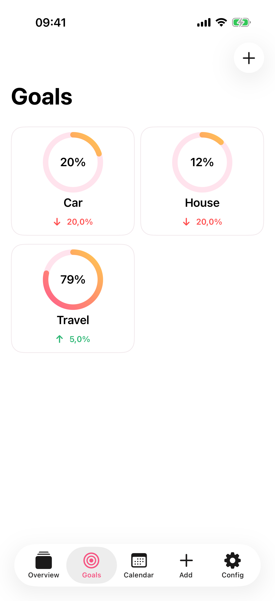
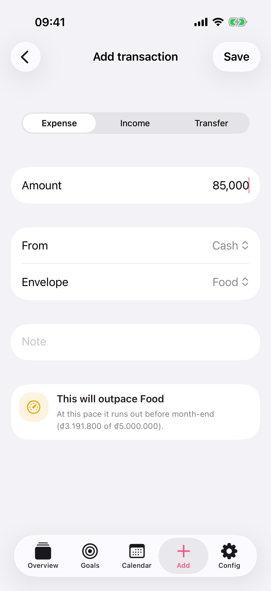

# Money Lover

A personal, **100% on-device** iPhone finance app. Native SwiftUI, Swift 6, SwiftData — no backend, no accounts, no network sync. All data lives locally on the device.

Track balances across accounts/cards/holdings, budget with envelopes, set savings goals, reconcile drift, and get deterministic rule-based spending advice.

> 🤖 **Built entirely by Claude.** Every line of this app — the SwiftUI views, the pure money-math engines, the SwiftData layer, the tests, the ADRs, even this README — was written by Claude (Anthropic's Claude Code), and **every change is verified by AI** before it lands. See [Built & verified by AI](#built--verified-by-ai).

> 💸 **Why it exists.** I built this to understand and reshape my own spending so I can save more and actually buy the things I want. Goals are first-class: every account, budget envelope, and transaction feeds a set of savings-goal rings that show how close each purchase is.

> Personal project (not for sale). Target: **iOS 26 / Swift 6.2 / SwiftUI only**, no third-party frameworks.

---

## Demo

A quick walkthrough — net worth at a glance, savings-goal rings closing in on the things I'm saving for, and logging an expense against a budget envelope:

<p align="center">
  
</p>

| Overview | Savings goals | Add transaction |
|:--------:|:-------------:|:---------------:|
|  |  |  |

> Captured on the iPhone 17 Pro simulator (iOS 26.5) with `Config → Debug → Seed sample data`. Numbers are demo data, not real balances.

---

## Requirements

| Tool | Version | Notes |
|------|---------|-------|
| macOS | Sonoma+ (Apple Silicon) | |
| Xcode | **26.5+** | Includes Swift 6.3 toolchain |
| iOS Simulator runtime | **iOS 26.5** | Install via Xcode → Settings → Components, or `xcodebuild -downloadPlatform iOS` |
| [XcodeGen](https://github.com/yonaskolb/XcodeGen) | 2.45+ | `brew install xcodegen` |

The Xcode **project file is generated** from `project.yml` by XcodeGen — it is not hand-edited. Any time you add, remove, or rename source files, regenerate it.

---

## Setup

```bash
# 1. Install the project generator (one time)
brew install xcodegen

# 2. From the project root, generate MoneyLover.xcodeproj
cd money-lover
xcodegen generate

# 3a. Open in Xcode and run (⌘R), or…
open MoneyLover.xcodeproj
```

There is nothing else to fetch — no SPM/CocoaPods/Carthage dependencies.

---

## Run on the Simulator (command line)

The project is wired for the **iPhone 17** simulator. Substitute any installed device name.

```bash
cd money-lover

# Boot the simulator and open the Simulator app
open -a Simulator
xcrun simctl boot "iPhone 17" 2>/dev/null

# Build, install, and launch
xcodebuild -project MoneyLover.xcodeproj -scheme MoneyLover \
  -destination 'platform=iOS Simulator,name=iPhone 17' \
  -derivedDataPath .build build

xcrun simctl install booted .build/Build/Products/Debug-iphonesimulator/MoneyLover.app
xcrun simctl launch --terminate-running-process booted com.hnkhoi.moneylover
```

Grab a screenshot of whatever's on screen:

```bash
xcrun simctl io booted screenshot /tmp/moneylover.png
```

List the simulators you have available:

```bash
xcrun simctl list devices available | grep -i iphone
```

### Seed sample data (DEBUG builds)

Launch with the seed flag to populate realistic demo data (accounts, cards, holdings, envelopes, goals, transactions):

```bash
xcrun simctl launch --terminate-running-process booted \
  com.hnkhoi.moneylover SIMCTL_CHILD_SEED_SAMPLE_DATA=1
```

You can also seed/clear from inside the app: **Config → Debug → Seed sample data / Clear all data** (DEBUG builds only). First launch with no data shows an onboarding sheet to set opening balances.

---

## Run the tests

[Swift Testing](https://developer.apple.com/documentation/testing) suite (TDD throughout — the pure `Core` engines are fully unit-tested).

```bash
cd money-lover
xcodebuild test -project MoneyLover.xcodeproj -scheme MoneyLover \
  -destination 'platform=iOS Simulator,name=iPhone 17' -derivedDataPath .build
```

Run a single suite while iterating:

```bash
xcodebuild test -project MoneyLover.xcodeproj -scheme MoneyLover \
  -destination 'platform=iOS Simulator,name=iPhone 17' -derivedDataPath .build \
  -only-testing:MoneyLoverTests/SignalEngineTests
```

In Xcode: **⌘U**.

---

## Built & verified by AI

Money Lover is an experiment in **fully AI-authored software**: Claude writes the code, and Claude verifies it. The point isn't novelty — it's that *nothing ships unverified*. Every change runs the same gauntlet:

1. **Authored by Claude** — features, fixes, tests, and docs are written by Claude Code against the rules in [`CLAUDE.md`](CLAUDE.md), the [engineering & testing guidelines](docs/guidelines/), and the [ADRs](docs/adr/). Money is always integer minor units + currency (never `Double`); architecture follows MV + pure services (ADR-0006).
2. **TDD, money-correctness first** — the pure `Core` engines are built test-first with [Swift Testing](https://developer.apple.com/documentation/testing). Write-flows get the full **cross-tab + relaunch** end-to-end treatment (ADR-0009) — proving a change reflects on every surface *and* survives a cold start, not just "the form dismissed".
3. **CI gate** ([`.github/workflows/ci.yml`](.github/workflows/ci.yml)) — every push and PR is type-checked, compiled, and run through the **unit** (Swift Testing) and **UI** (XCUITest) suites on a fresh `macos-26` runner. Red CI blocks the merge.
4. **AI code review** ([`.github/workflows/claude-review.yml`](.github/workflows/claude-review.yml)) — on every PR, **Claude reviews its own diff** against the repo's guidelines and money-correctness invariants, posting inline findings. A second AI pass that catches what green tests don't: leaked abstractions, missed edge cases, a forgotten version bump.
5. **Versioned every PR** (ADR-0008) — `project.yml` marketing/build versions bump and `CHANGELOG.md` gets an entry on every change, so the AI-authored history stays auditable.

```
Claude writes ─▶ TDD (Swift Testing) ─▶ CI: build + unit + UI tests ─▶ Claude reviews the PR diff ─▶ merge
```

### Enabling the AI review workflow

The review workflow needs one repository secret:

1. Create an API key at [console.anthropic.com](https://console.anthropic.com/).
2. **Settings → Secrets and variables → Actions → New repository secret** → name it `ANTHROPIC_API_KEY`.

Without the secret the job skips cleanly (it never fails red). You can also re-trigger a review by commenting `@claude review` on any PR.

> The demo GIF and screenshots above are produced the same way — driven on the simulator through the app's stable [accessibility identifiers](MoneyLover/App/AccessibilityID.swift), the same handles the XCUITest suite uses, so the "demo" and the "tests" exercise the exact same flows.

---

## Project structure

```
money-lover/
├── project.yml              # XcodeGen spec — source of truth for the Xcode project
├── MoneyLover/
│   ├── App/                 # @main entry, RootView (tabs), AppSchema (SwiftData models)
│   ├── Core/                # Pure domain types + engines (no SwiftData, fully tested)
│   ├── Persistence/         # @Model …Record types + Repositories (mapped at the edge)
│   ├── Services/            # Side-effecting helpers (e.g. live price/rate fetch)
│   ├── DesignSystem/        # Theme tokens, shared views
│   ├── Features/            # One folder per feature (Store + screens)
│   ├── Debug/               # SampleData (DEBUG only)
│   └── Resources/           # Assets
├── MoneyLoverTests/         # Swift Testing suites
├── docs/                    # ADRs + engineering/testing/agent guidelines
├── CONTEXT.md               # Domain glossary
└── prototype/               # Throwaway HTML visual reference (not built)
```

**Architecture** (see `docs/adr/0006-mv-architecture-pure-domain.md`): thin SwiftUI Views → `@MainActor @Observable` Stores → pure `Core` engines → `Persistence` repositories. Money is always integer minor units + currency — never `Double`.

For the full picture before contributing, read `CLAUDE.md`, then `docs/guidelines/{engineering,testing}.md` and `docs/adr/`.

---

## Troubleshooting

- **"No such module" / red errors in Xcode after adding files** — you added a source file without regenerating. Run `xcodegen generate`.
- **Build fails: iOS 26.5 runtime missing** — `xcodebuild -downloadPlatform iOS`, or install via Xcode → Settings → Components.
- **`xcrun simctl: device not booted`** — `xcrun simctl boot "iPhone 17"` first (or pick a name from `simctl list devices available`).
- **Signing errors when building to a physical device** — set your team in Xcode (Signing & Capabilities); `DEVELOPMENT_TEAM` is intentionally blank in `project.yml` for simulator-only builds.

---

## Status

14 of 16 planned features implemented and tested (simulator-verified). The two remaining features — **Voice entry** (on-device speech + Foundation Models) and the **Accessibility/rotation pass** — require a physical device and are tracked in `.scratch/money-lover/issues/`.
